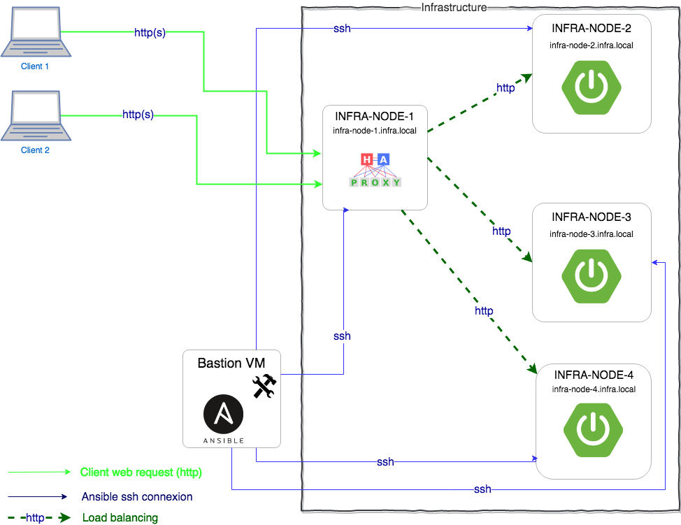

# learn-ansible

## Notre objectif

L'objectif de ce tutoriel est d'apprendre à installer une infrastructure complexe grâce à [Ansible](https://docs.ansible.com/ansible/latest/index.html).

## Architecture technique cible

Notre infracstructure sera composé de 5 VMs réparties comme suit:

- **1 x BASTION:** Cette VM va nous servir de point d'accès aux autres machines de l'infra. Ansible sera installé et exécuté sur cette VM.
- **3 x VMs applicatives:** Sur les quelles nous allons installer une application [Spring-Boot](https://spring.io/projects/spring-boot) qui exposera des endpoints REST.
- **1 x VM [HAProxy](http://www.haproxy.org/):** Nous servira de load balancer (Front end) pour les clients.

    Vous pouvez ajuster le nombre de VM si besoin, l'idée reste la même.



## Avant de commencer

* Clonez le repo git

```sh
# Clonez le repo sur votre poste local dans le répertoire de votre choix
git clone https://github.com/runadium/learn-ansible.git
```

* Pour voir la version finalisée du tutoriel

Cependant si votre objectif est d'apprendre les bases d'Ansible je vous conseille de suivre pas à pas le tutoriel et de vous référer à la branch **final** uniquement en cas d'erreur ou de doute.

```sh
# Switcher sur la branch final
git checkout final
```

La branche **final** de ce repo contient tous les fichiers que nous allons créer pas à pas dans ce tutoriel.

## Step 1: Installation de l'environement

### Vagrant

Nous allons utiliser [Vagrant](https://www.vagrantup.com/) pour simuler (par virtualisation) notre infrastructure. Cet outil est indipensable si vous voulez faire de l'infra en local.

#### Installation de Vagrant

Suivez les instructions sur la page [officiel](https://www.vagrantup.com/intro/getting-started/install.html) pour installer Vagrant sur votre poste local (si vous ne l'avez pas déja)

#### Plugins à installer

- *vagrant-vbguest* (conseillé) `vagrant plugin install vagrant-vbguest`
- *vagrant-env* (conseillé) `vagrant plugin install vagrant-env`
- *vagrant-timezone* (conseillé) `vagrant plugin install vagrant-timezone`
- *vagrant-proxyconf* (si vous êtes derrière un proxy d'entreprise) `vagrant plugin install vagrant-proxyconf`

#### Démarrer notre infrastructure

```sh
# Dupliquer le fichier .env afin de pouvoir le customiser
cp .env.template .env
# Vérifier les VMs qui vont être crées
vagrant status
# Démarrer les instances
vagrant up

# Se connecter en ssh sur le noeud BASTION
vagrant ssh BASTION-NODE

# Passer en root
sudo su

# Se déplacer dans le répertoire /learn-ansible (qui sera notre répertoire de travail)
mkdir /learn-ansible && cd /learn-ansible
```

Essayez de contacter les noeuds de l'infra (depuis la VM BASTION) pour vérifier le setup

```sh
# Par exemple
ping infra-node-1.infra.local
```

## Step 2: Installer Ansible sur le  BASTION

### Installer le repo epel-release

```sh
yum --enablerepo=extras install -y epel-release
```

### installation de *pip*

```sh
yum -y install -y python-pip git tree java-1.8.0-openjdk-devel
```

### Installation de Ansible

```sh
pip install ansible
```

### Tester l'infrastructure avec Ansible

Nous allons exécuter un `ping` sur tous les noeuds que nous avons dans notre infra.

#### Ping de localhost avec Ansible

```sh
ansible -m ping localhost
```

#### Créer l'inventaire des serveurs dans le fichier /etc/ansible/hosts (fichier inventaire par défaut)

```sh
mkdir /etc/ansible
cat > /etc/ansible/hosts <<EOF

# Default User and password to use
[all:vars]
ansible_user = root
ansible_ssh_pass= vagrant

# Ce group n'est pas obligatoire, il est nécessaire seulement si aucun autre groupe n'est définit
[all]
infra-node-1.infra.local
infra-node-2.infra.local
# Rajoutez autant de serveur que vous en avez

# Permet de cibler uniquement les serveurs du groupe A
[groupA]
infra-node-1.infra.local

# Permet de cibler uniquement les serveurs du groupe B
[groupB]
infra-node-2.infra.local

EOF

cat > ~/.ansible.cfg <<EOF

[defaults]
host_key_checking = False

EOF
```

#### Ping l'ensemble des serveurs avec Ansible

```sh
ansible -m ping  all
```

Le mot de pass root par defaut est `vagrant`. Oui Ansible à besoin des information d'authentification pour pouvoir se connecter en SSH sur les noeuds de notre infrastructure.
Il y'a plusieurs façon de s'authentifier en ssh:

- **user/password**: c'est ma méthode que nous allons utiliser pour faire simple
- **certificats (private/public key)**: Dans la vraie vie vous allez plutôt utiliser des certificats pour vous connecter à vos différents serveurs. Ce n'est pas l'objectif de ce tutoriel


Le résultat attendue est le suivant (l'ordre des serveurs n'est pas important):

```sh
[root@bastion ~]# ansible -m ping  all
infra-node-2.infra.local | SUCCESS => {
    "changed": false,
    "ping": "pong"
}
infra-node-1.infra.local | SUCCESS => {
    "changed": false,
    "ping": "pong"
}
[root@bastion ~]#
```

#### Autres exemples de commandes à lancer sur tous nos serveurs

##### Voir la mémoire disponible sur tous les serveurs

```sh
ansible -a "/bin/sh -c 'free -h'"  all
# ou
ansible -m command -a "free -h"  all
# ou pour cibler uniquement un groupe
ansible -m command -a "free -h"  groupA
```

##### Voir l'espace disque disponible sur tous les serveurs

```sh
ansible -a "/bin/sh -c 'df -h'"  all
# ou
ansible -m command -a "df -h"  all
# ou pour cibler uniquement un groupe
ansible -m command -a "df -h"  groupA
```

## Step 3: Préparation de nos différents environnements

Nous allons considérer que nous avons plusieurs environnements cibles (DEV,RECETTE, QUALIF ...), même si dans ce tutoriel nous allons traiter que l'environnemment de DEV.

### Création de la structure des environnements

```sh
# Création des dossiers par environnement
mkdir -p environments/dev
mkdir -p environments/qualif
mkdir -p environments/prod

# Création de la structure complète pour l'environnement de dev
mkdir -p environments/dev/group_vars # Ce répertoire contient les variables par groupe
mkdir -p environments/dev/host_vars # Ce répertoire contient les variables par host (machine)

cat > environments/dev/hosts <<EOF

# Default User and password to use
[all:vars]
ansible_user = root
ansible_ssh_pass= vagrant

# Ce group n'est pas obligatoire, il est nécessaire seulement si aucun autre groupe n'est définit
[all]
infra-node-1.infra.local
infra-node-2.infra.local
infra-node-3.infra.local
infra-node-4.infra.local

# Group HaProxy, Pour le tuto l'HAProxy sera installé sur une machine unique comme indiqué dans le schema d'architecture
[ha-proxy]
infra-node-1.infra.local

# Permet de cibler uniquement les serveurs du groupe B
[spring-boot-app]
infra-node-2.infra.local
infra-node-3.infra.local
infra-node-4.infra.local

# Ces notations permettent de définir des groupes à partir de groupes déja existant.
[loadbalancer:children]
ha-proxy

[applis:children]
spring-boot-app

EOF

# Création du répertoire roles qui contiendra les roles (dans notre cas le role ha-proxy que nous allons écrire)
mkdir roles

```

Nous allons travailler essentielement sur l'environnement "dev", pour ça nous allons dire à Ansible d'utiliser ce répertoire comme notre environnement par défaut.

Le fichier **ansible.cfg** permet de configuer le setup ansible. Nous allons créer ce fichier avec le minimum de configuration, nous verrons par la suite à quoi sert chacun de ces paramètres.

```sh
cat > /learn-ansible/ansible.cfg <<EOF

[defaults]
ansible_managed = Please do not modify this file directly as it is managed by Ansible and could be overwritten.
host_key_checking = False

# Inventaire par défaut quand l'environnement n'est pas précisé en ligne de commande.
inventory = ./environments/dev

# Répertoires par défaut qui contiendront nos différents roles.
roles_path = ./galaxy_roles/:./roles/

EOF

```

## Step 4: Installation de l'application Spring boot

### Clone et build du projet

Nous allons utiliser une application spring-boot très basique [simple-springboot-app](https://github.com/runadium/simple-springboot-app) qui expose un endpoint REST.

```sh
# Checkout de l'appli spring boot (pour la builder en local)
git clone https://github.com/runadium/simple-springboot-app.git /simple-springboot-app

cd /simple-springboot-app
# Packager l'application en JAR (service Spring Boot)
./mvnw package
# Vérifier que l'appli a bien été packagé
ls -alrt /simple-springboot-app/target
# On retrouve bien le fichier simple-springboot-app-0.0.1-SNAPSHOT.jar

# Retour dans notre répertoire de travail
cd /learn-ansible
```

### Installation du role [springboot-service](https://github.com/orachide/ansible-role-springboot)

Nous allons utiliser un role [springboot-service](https://github.com/orachide/ansible-role-springboot) pour installer notre appli (cela nous permettra également de voir comment utiliser un role déja existant soit sur la galaxy Ansible soit au sein de notre entreprise). Voir le [Readme](https://github.com/orachide/ansible-role-springboot/blob/master/README.md) du role pour plus de détails.

```sh
# Installation du role springboot-service depuis la galaxy Ansible public
ansible-galaxy install orachide.springboot-service
```

Par défaut la commande **ansible-galaxy install** va placer le role télécharger dans **./galaxy_roles/**.

```sh
# Vérifier les roles téléchargés
ls -alrt galaxy_roles/
# On retrouve 2 roles (dont geerlingguy.java qui est une dépendance du role springboot-service que nous avons installé)
```

### Création du playbook de déploiement de l'appli simple-springboot

```sh
cat > /learn-ansible/deploy-simple-springboot-app.yml <<EOF

---
- name: Deploy Simple Spring boot App
  hosts: spring-boot-app # On indique le groupe qui a été défini dans notre inventaire
  vars:
    sb_java_package: java-1.8.0-openjdk
    sb_user_groups_definitions:
      - name: sbgroup
    sb_users_definition:
      - name: Simple Spring boot App User
        username: sbuser
        groups: [sbgroup]
  roles:
    - role: orachide.springboot-service # On indique le role que nous avons installé depuis la Galaxy ainsi que les variables dont ce role aura besoin
      sb_app_name: simple-springboot-app
      sb_app_group_id: fr.runadium
      sb_app_artifact_id: simple-springboot-app
      sb_app_version: 0.0.1-SNAPSHOT
      sb_app_extension: jar
      sb_app_user: sbuser
      sb_app_user_group: sbgroup
      sb_app_artifact_file: "/simple-springboot-app/target/simple-springboot-app-0.0.1-SNAPSHOT.jar"
      sb_app_healthcheck_urls:
        - "https://localhost:8443/actuator/health"
        - "http://localhost:8080/actuator/health"
      sb_app_healthcheck_ports:
        - 8080
        - 8443

EOF
```

### Exécution du playbook d'installation de l'appli Spring Boot sur les VM du groupe spring-boot-app

```sh
# Pas besoin de préciser l'environnement parce que nous avons configuré l'environnement dev par défaut
ansible-playbook deploy-simple-springboot-app.yml
```

Pas besoin de se connecter sur chaque VM séparemment pour vérifier que les applis sont bien installées et démarées. Vous pouvez exécuter la commande suivante pour le faire. C'est un des intérets de Ansible.

```sh
# Pour vérifier que l'appli a bien été déployé sur les VM du groupe spring-boot-app.
ansible -m command -a "systemctl status simple-springboot-app" spring-boot-app
```

Vous devriez voir que pour chaque VM le statut du service **simple-springboot-app** est **active**.

## Step 5: Création du role d'installation de HAProxy

Maintenant que nos applis Spring Boot sont installées et démarrées, nous allons écrire le role nous permettant d'installer **HAPROXY** comme loadbalancer devant les applications Spring Boot.

Afin de pratiquer le TDD, nous allons commencer par penser aux tests de notre futur role.

### Test avec Molecule

[Molecule](https://molecule.readthedocs.io/en/latest/) est un framework qui permet de tester nos roles Ansible.
Le principe de molecule est de créer notre Infra de test, d'exécuter notre role (via un playbook) et ensuite de vérifier que tout s'est bien passé grace notamment à [TestInfra](https://testinfra.readthedocs.io/en/latest/). Les tests seront écrits en Python.

[Molecule](https://molecule.readthedocs.io/en/latest/) permet de créer l'infra de test avec **Docker**, **Vagrant** ou **Openstack**, **ec2**, **azure**. Nous allons dans notre cas nous baser sur une infra de test qui utilisera **Docker**

#### Installation de molecule sur la VM Bastion

```sh
# Molecule utilisera Docker pour les tests
yum install -y docker
systemctl enable docker.service
systemctl start docker.service
# Vérifier que Docker est bien installé et démarré
docker info

# Installation de prérequis à molecule
yum install -y gcc python-devel openssl-devel libffi-devel

# Installation de Molecule et le client docker python
pip install molecule docker
```

#### Creation du role HAPROXY

```sh
cd roles
# La commande suivante va créer la structure de notre role haproxy
molecule init role -r haproxy -d docker
cd haproxy
```

La structure du répertoire du role haproxy qui a été crée par molecule est la suivante:

    haproxy/
    ├── defaults            # Contient les valeurs par défaut de notre role
    │   └── main.yml
    ├── handlers            # Contient la définition des Handlers qui seront utilisés
    │   └── main.yml
    ├── meta                # Meta données utiles si on veut déployer le role sur la galaxy
    │   └── main.yml
    ├── molecule            # Contient les tests molecule de notre role
    │   └── default
    │       ├── Dockerfile.j2   # Dockerfile qui sera utilisé pour créer les containers de test
    │       ├── INSTALL.rst
    │       ├── molecule.yml    # Paramètres utilisés par Molecule
    │       ├── playbook.yml    # Playbook de test qui utilisera le role haproxy
    │       └── tests
    │           ├── test_default.py # Tests python basés sur TestInfra
    │           └── test_default.pyc
    ├── README.md
    ├── tasks               # Contient l'ensemble des taches (task) à exécuter
    │   └── main.yml
    └── vars                # Contient la définition des varibles qui ne changeront pratiquement jamais(constantes)
        └── main.yml

    8 directories, 12 files

Molecule a généré un test basique de notre role. Ce test va simplement créer une instance Docker (Centos:7) et vérifier que le fichier **/etc/hosts** existe bien et appartient à l'utilisateur **root**. Donc rien à voir avec HAPROXY mais la base de test est là.

```sh
# Exécuter les tests par défaut de molecule
molecule test # Le test va passer car même si nous n'avons rien implémenté pour le moment, molecule a généré un test minimum qui passera à tout les coups

# Pour exécuter les tests sans détruire les containers de test à la fin, exécutez la commande suivante
molecule test --destroy never
```

##### Préparation des tests minimaaux avec TestInfra

Nous allons dans un premier temps à minima tester que le service haproxy est bien installé et démarré. Modifions le fichier **molecule/default/tests/test_default.py** pour vérifier que le service est *running*.

```sh
#
cat > /learn-ansible/roles/haproxy/molecule/default/tests/test_default.py <<EOF

import os

import testinfra.utils.ansible_runner

testinfra_hosts = testinfra.utils.ansible_runner.AnsibleRunner(
    os.environ['MOLECULE_INVENTORY_FILE']).get_hosts('all')

def test_haproxy_package_is_installed(host):
    package = host.package("haproxy")
    assert package.is_installed


def test_haproxy_service_is_started(host):
    service = host.service('haproxy')
    assert service.is_running
    assert service.is_enabled
EOF
```

    Docker ne permets pas d'utiliser les services à l'intérieur d'un container par défaut. Nous allons néanmoins faire le nécessaire (dans le fichier molecule/default/molecule.yml)

```sh
# Remplacons le fichier par défaut en rajoutant nos modifications
cat > /learn-ansible/roles/haproxy/molecule/default/molecule.yml <<EOF
---
dependency:
  name: galaxy
driver:
  name: docker
lint:
  name: yamllint
platforms:
  - name: instance
    image: centos:7
    privileged: true                    # Ligne rajouté pour gérer les services dans Docker
    command: '/sbin/init'               # Ligne rajouté pour gérer les services dans Docker
    cap_add: ['SYS_ADMIN', 'SETPCAP']   # Ligne rajouté pour gérer les services dans Docker
provisioner:
  name: ansible
  lint:
    name: ansible-lint
scenario:
  name: default
verifier:
  name: testinfra
  lint:
    name: flake8
EOF
```

Exécutons de nouveau les tests qui cette fois ci devraient être KO puisque nous n'avons pas encore écrit la procédure d'installation de [HaProxy](http://www.haproxy.org/).

```sh
# pour gagner du temps sur les prochaines éxécutions des tests nous allons rajouter l'option --destroy never
molecule test --destroy never
```

Le test doit se terminer en erreur avec les messages suivants:

    =================================== FAILURES ===================================
    ____________ test_haproxy_package_is_installed[ansible://instance] _____________

    host = <testinfra.host.Host object at 0x7f0e78057ad0>

        def test_haproxy_package_is_installed(host):
            package = host.package("haproxy")
    >       assert package.is_installed
    E       assert False
    E        +  where False = <package haproxy>.is_installed

    tests/test_default.py:11: AssertionError
    _____________ test_haproxy_service_is_started[ansible://instance] ______________

    host = <testinfra.host.Host object at 0x7f0e78057ad0>

        def test_haproxy_service_is_started(host):
            service = host.service('haproxy')
    >       assert service.is_running
    E       assert False
    E        +  where False = <service haproxy>.is_running

    tests/test_default.py:16: AssertionError
    =========================== 2 failed in 7.96 seconds ===========================

Les messages d'erreur sont très clairs, le package **haproxy** n'est pas installé et le service n'est pas **Running**.

Nous allons maintenant écrire le role **haproxy** et nous assurer que les tests passeront cette fois ci.

Pour exécuter uniquement les tests sans rejouer toutes les étapes (création des containers), nous pouvons exécuter la commande suivante:

```sh
# Exécuter uniquement les tests avec TestInfra
molecule verify
```

##### Implémentons le role haproxy

Dans un role Ansible, les tâches principales à exécuter pour dérouler notre role sont dans le fichier **tasks/main.yml**.

###### Installation du package haproxy

```sh
cat > /learn-ansible/roles/haproxy/tasks/main.yml <<EOF
---

- name: Ensure HAProxy package is installed.
  package:
    name: haproxy
    state: present

EOF
````

Réexecutons le role puis les tests pour s'assurer que le test de vérification de la présence du package **haproxy** est **OK**.

```sh
# Exécuter le role sur les container Docker de test
molecule converge

# Exécuter à nouveau les tests
molecule verify
```

Cette fois ci il n'y a plus qu'une seule erreur (**service is not running**). Le test qui vérifie que le package est installé est **OK**

    =================================== FAILURES ===================================
    _____________ test_haproxy_service_is_started[ansible://instance] ______________

    host = <testinfra.host.Host object at 0x7f02ff1a7b10>

        def test_haproxy_service_is_started(host):
            service = host.service('haproxy')
    >       assert service.is_running
    E       assert False
    E        +  where False = <service haproxy>.is_running

    tests/test_default.py:16: AssertionError
    ====================== 1 failed, 1 passed in 8.24 seconds ======================

Si vous doutez de la sortie de **Testinfra**, vous pouvez vérifier vous même en vous connectant au container de test.

```sh
# Voir la liste des containers de test
molecule list

# Se connecter en ssh à l'unique instance de test
molecule login

# Une fois connecté, vérifier que haproxy est bien installé
yum list installed haproxy # a exécuter depuis le container Docker

# Se déconnecter du container
exit
```

###### Activation et démarrage du service HAProxy

```sh
cat > /learn-ansible/roles/haproxy/tasks/main.yml <<EOF
---

- name: Ensure HAProxy package is installed.
  package:
    name: haproxy
    state: present

- name: Ensure HAProxy is started and enabled on boot.
  service:
    name: haproxy
    state: started
    enabled: yes

EOF
```

Réexecutons le role puis les tests pour s'assurer que le test de vérification de la présence du package **haproxy** est **OK**

```sh
# Exécuter le role sur les container Docker de test
molecule converge

# Exécuter à nouveau les tests
molecule verify
```

Hourraa !!! Tous nos tests sont **OK** cette fois ci.

    =========================== 2 passed in 8.69 seconds ===========================

Pas compliqué n'est ce pas? Nous avons déja un role qui installe et démarre haproxy.

*Wait!!!* Nous n'avons pas configuré **HAProxy** pour qu'il soit en frontal de nos applis **Spring Boot**.

**Let's do it!!!**

###### Configuration de HAProxy

Il nous faudra être capable de générer la configuration de **HAProxy** en fonction des VM backend (**simple-springboot-app)

Le fichier de configuration final devra ressembler à celui ci:

    global
        log /dev/log    local0
        log /dev/log    local1 notice
        chroot /var/lib/haproxy
        user haproxy
        group haproxy
        daemon

    defaults
        log     global
        mode    http
        option  httplog
        option  dontlognull
        timeout connect 5000
        timeout client  50000
        timeout server  50000

    frontend appfrontend
        bind *:80
        mode http
        default_backend appbackend

    backend appbackend
        mode http
        balance roundrobin
        option forwardfor
        server infra-node-1.infra.local 192.168.77.31:8080 check
        server infra-node-2.infra.local 192.168.77.32:8080 check

Le but n'étant pas de parcourir toute les configurations possibles d'**HAProxy**, nous allons nous contenter de cette configuration minimaliste qui devrait répondre à notre besoin de **loadbalancing** pour nos applis spring boot.

Vous remarquerez cependant que cette configuration n'est pas satisfaisante, car elle n'est pas configurable, c'est à dire que par exemple si le l'adresse IP d'une VM change ou si nous rajoutons une VM (Spring Boot) elle ne sera pas automatiquement rajouté dans la configuration d'HAProxy

Modifions notre role pour qu'il puisse gérer les mises à jour de notre infra.

* Ajout du template de configuration haproxy e utilisant le templating [Jinja2](http://jinja.pocoo.org/docs/2.10/).

```sh
mkdir /learn-ansible/roles/haproxy/templates

# Création du templae de configuration (Jinja 2)
cat > /learn-ansible/roles/haproxy/templates/haproxy.cfg.j2 <<EOF
# {{ansible_managed}}
global
    log /dev/log    local0
    log /dev/log    local1 notice
    chroot /var/lib/haproxy
    user haproxy
    group haproxy
    daemon

defaults
    log     global
    mode    http
    option  httplog
    option  dontlognull
    timeout connect 5000
    timeout client  50000
    timeout server  50000

frontend {{ haproxy_frontend_name }}
    bind *:80
    mode {{ haproxy_frontend_mode }}
    default_backend {{ haproxy_backend_name }}

backend {{ haproxy_backend_name }}
    mode {{ haproxy_backend_mode }}
    balance {{ haproxy_backend_balance }}
    option forwardfor

    server {{ backend.name }} {{ backend.address }} {{ backend.name }} check


EOF
```

* Modification de /learn-ansible/roles/haproxy/tasks/main.yml pour gérer la copie (templating) de la configuration de l'HAPROXY.

```sh
# Mise à jour de notre fichier tasks principal
cat > /learn-ansible/roles/haproxy/tasks/main.yml <<EOF
---

- name: Ensure HAProxy package is installed.
  package:
    name: haproxy
    state: present

- name: Ensure HAProxy is started and enabled on boot.
  service:
    name: haproxy
    state: started
    enabled: yes

- name: Source HAProxy configuration file.
  template:
    src: haproxy.cfg.j2
    dest: /etc/haproxy/haproxy.cfg
    mode: 0644
  notify: restart haproxy # Ici on demande à Ansible de redémarrer HAProxy dès que la configuration a changé

EOF
```

* Création du Handler dont le but sera de redémarrer HAProxy lorscequ'il sera notifié.

```sh
# Mise à jour du fichier handler pour gérer les demandes de redémarrage
cat > /learn-ansible/roles/haproxy/handlers/main.yml <<EOF
---

- name: restart haproxy
  service:
    name: haproxy
    state: restarted

EOF
```

Re exécutons notre role pour voir les changements.

```sh
molecule converge
```

Oups!! nous obtenos l'erreur suivante:

    TASK [haproxy : Source HAProxy configuration file.] ****************************
    fatal: [instance]: FAILED! => {"changed": false, "msg": "AnsibleUndefinedVariable: 'haproxy_frontend_name' is undefined"}

    PLAY RECAP *********************************************************************
    instance                   : ok=3    changed=0    unreachable=0    failed=1

La variable **haproxy_frontend_name** n'est pas connue  de Ansible. En fait c'est le cas pour toutes les variables qui sont utilisés dans le template de configuration de l'HAProxy (*/learn-ansible/roles/haproxy/templates/haproxy.cfg.j2*)


* Modifions le playbook utilisé par molecule pour les tests afin de définir des valeurs pour les variables dont a besoin le role

```sh
cat > /learn-ansible/roles/haproxy/molecule/default/playbook.yml <<EOF
---

- name: Converge
  hosts: all
  vars:
    haproxy_frontend_name: simple-springboot-app-frontend
    haproxy_frontend_mode: http
    haproxy_backend_mode: http
    haproxy_backend_balance: roundrobin
    haproxy_backend_name: simple-springboot-app-backend
    haproxy_backend_servers:
      - name: app1 # ces différentes valeurs servent simplement à fournir aux roles des valeurs pour le test
        address: 192.168.0.1:80 # pareil pour l'adresse qui ne correspond pas réelement à notre backend
  roles:
    - role: haproxy

EOF
```

Re exécutons notre role pour voir les changements.

```sh
molecule converge
```

Cette fois ci notre role s'est bien exécuté.

Notez sur bien que le handler (responsable du redémarrage de l'HAProxy) s'est déclenché parceque le fichier de configuration à changer.

 Pour voir le contenu du fichier de configuration final (celui dans le container Docker de test de molecule), faire les commandes suivante:

 ```sh
# Se connecter sur le container
molecule login

# Une fois dans le container
cat /etc/haproxy/haproxy.cfg

# Ensuite pour sortir du container
exit
 ```

On voit que Ansible à bien renseigné toutes les variables attendues.

    A vous d'enrichir les tests du role pour ajouter la vérification de la configuration haproxy si vous avez besoin de le faire.


### Playbook d'installation de l'HAPROXY

Maintenant que les tests de notre role sont écris et passent tous (même s'ils ne sont pas complet), nous allons créer un playbook de déploiement de **HAProxy** pour le déployer sur notre super infra.

```sh
# retournons dans notre répertoire de bas /learn-ansible pour la suite
cd /learn-ansible
```

#### Création du playbook

```sh
cat > /learn-ansible/deploy-haproxy.yml <<EOF
---

- name: Deploy HAProxy as App loadbalancer
  hosts: ha-proxy # Ce group cible les machines sur lesquelles nous allons installer HAProxy
  vars:
    haproxy_frontend_name: simple-springboot-app-frontend
    haproxy_frontend_mode: http
    haproxy_backend_mode: http
    haproxy_backend_balance: roundrobin
    haproxy_backend_name: simple-springboot-app-backend
  pre_tasks:
    - set_fact:
        haproxy_backend_servers: "{{ (haproxy_backend_servers | default([])) + [{'name':  item  ,'address':  item + ':8080'  }] }}"
      with_items: "{{ groups['spring-boot-app'] }}"
  roles:
    - role: haproxy

EOF

```

Exécutons le playbook de déploiement de HAProxy

```sh
ansible-playbook deploy-haproxy.yml
```

Pour tester que tout fonctionne bien:

- Ouvrez votre navigateur web préféré sur votre poste local
- Aller à l'adresse suivante: **http://192.168.77.31/hello**
- Rafraichissez cette page plusieurs fois pour constater dans le message affiché qu'à chaque appel c'est une instance différente de nos applications **Spring Boot** qui réponds.

Nous l'avons fait !! Nous venons de mettre en place l'infra tel que décrite au début du tuto.